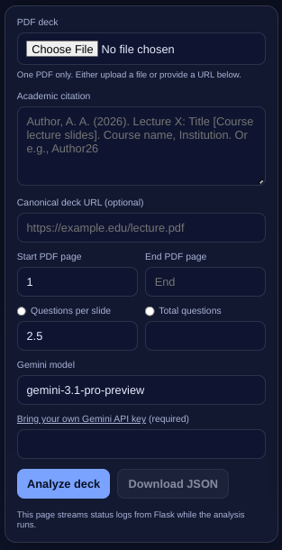
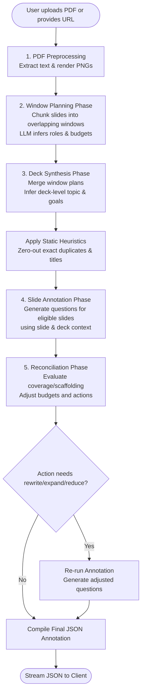
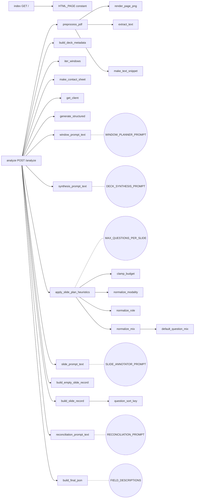
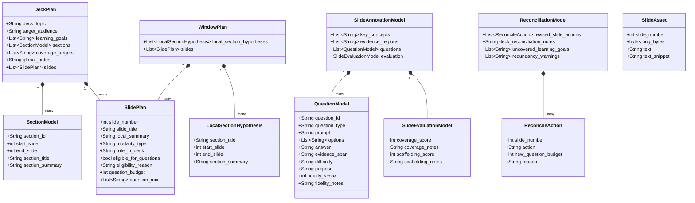

# Slide Deck Q&A Quality Assurance app

[](https://slidesqaqa-974767694043.us-west1.run.app/)
[](https://slidesqaqa-974767694043.us-west1.run.app/health-check)
[](https://www.python.org/downloads/)
[](https://pypi.org/project/google-genai/)
[](https://pypi.org/project/PyMuPDF/)
[](https://pypi.org/project/Pillow/)
[](https://pypi.org/project/pydantic/)
[](https://opensource.org/licenses/MIT)

This app uploads and/or downloads a PDF slide deck, asks for a citation, and then runs a three-pass Gemini workflow that produces one hierarchical JSON annotation file for the whole deck.


Try it: https://slidesqaqa-974767694043.us-west1.run.app

## What it does

- Saves the uploaded PDF into a per-run `jobs/<job_id>/` directory.
- Renders every slide to a PNG image with PyMuPDF.
- Extracts native PDF text for each slide.
- Runs a windowed deck-planner pass over slide thumbnail contact sheets plus text snippets.
- Synthesizes a full-deck plan with:
  - deck topic
  - target audience
  - learning goals
  - section boundaries
  - per-slide role, eligibility, question budget, and question mix
- Runs a slide-annotation pass only on slides that should receive questions.
- Runs a final deck-reconciliation pass to reduce, expand, rewrite, or zero-out slide budgets.
- Streams status lines to the browser while it works.
- Ends by streaming the full formatted JSON result and also saves it to disk.

### Output shape

The final JSON includes:

- `schema_version`
- `field_descriptions`
- `deck_metadata` (e.g., deck ID, citation, original URL, source file, total slides)
- `deck_analysis` (e.g., topic, target audience, learning goals, sections, coverage targets, global notes)
- `reconciliation` (e.g., revised slide actions, deck reconciliation notes, uncovered learning goals, redundancy warnings)
- `slides` (ordered list of slide records)

Each slide contains:
- metadata (number, title, modality, role, summary, concepts, evidence regions)
- an `eligible_for_questions` boolean and budget
- an `evaluation` object containing coverage and scaffolding scores
- a variable-length `questions` array. Each question contains a prompt, optional multiple-choice options, a grounded answer, evidence span, difficulty, purpose, and fidelity score. Some slides may have zero questions.

## Requirements

- Python 3.10+
- `google-genai` 1.8 or compatible
- The packages in [`requirements.txt`](requirements.txt)

## How to Install and Test

```bash
python -m venv .venv
source .venv/bin/activate
pip install -r requirements.txt
```

### Run

```bash
python flask-app.py
```

Then open: `http://127.0.0.1:8080`

## Main form fields



- PDF deck upload
- citation
- optional canonical deck URL
- optional start (default=1) and end slide numbers as PDF pages
- optional target questions per slide or total number of questions
- Gemini model name
- Bring your own Gemini API key (required)

### Default model

The app defaults to `gemini-3.1-pro-preview`

### Troubleshooting

If a model response fails schema validation, the streamed log will show the validation error. In that case, rerun the job or reduce deck size.

### Explanatory output

Once the analysis is complete, the browser shows the final JSON output, offering to download it, and renders four explanatory sections:

- **Executive Summary:** Describes the deck topic, target audience, learning goals, uncovered learning goals, and global notes.
- **Deck Outline:** Shows the inferred section boundaries and a brief summary for each slide.
- **Question Bank:** Lists the generated questions grouped by slide, including prompts, multiple-choice options (if any), and grounded answers.
- **Evaluation Matrix:** Provides a table summarizing the question budget, coverage score, scaffolding score, and reconciliation notes for every slide.

## Notes

- This is a development app, not a hardened production deployment.
- Large decks cost more and take longer because the app performs multiple model passes.
- The app uses per-slide PNG rendering plus extracted PDF text rather than direct PDF ingestion so that it can build contact sheets and control slide-local prompts.
- Zero-question slides receive empty question arrays and `null` slide-level coverage/scaffolding scores in the final JSON.

## System Architecture and Flow## How the streaming UI works

- The Flask `/analyze` route uses `stream_with_context(...)`.
- The server emits timestamped status lines while each stage runs.
- At the end, the server emits:
  - `===== FINAL JSON BEGIN =====`
  - the formatted JSON
  - `===== FINAL JSON END =====`

The browser separates the status log from the final JSON automatically.

### 1. Conceptual LLM Pipeline

This flowchart outlines the high-level logic and data flow across the four-stage generative pipeline.



### 2. Python Execution Call Graph

This flowchart maps the strict execution hierarchy of Python functions, showing when utility functions are used and how standard prompts are injected.



### 3. Pydantic Data Models

This class diagram documents the internal strict typing relationships managed by Pydantic before being dumped to the final JSON file.



### 4. Output JSON schema

This section describes the structure and descriptions of the final output JSON schema.

```json
{
  "schema_version": "Version of this JSON schema.",
  "field_descriptions": {
    "...": "Field descriptions mapping"
  },
  "deck_metadata": {
    "deck_id": "Stable identifier for this deck.",
    "deck": "Full academic citation for the deck.",
    "deck_url": "Original source URL for the deck, if known.",
    "source_file": "Local uploaded PDF filename.",
    "total_slides": "Total number of PDF pages processed as slides.",
    "processed_at": "UTC timestamp when this JSON was produced."
  },
  "deck_analysis": {
    "deck_topic": "Short description of the overall topic of the deck.",
    "target_audience": "Estimated audience level; for example undergraduate, graduate, or mixed.",
    "learning_goals": ["List of deck-level learning goals inferred from the slides."],
    "sections": [
      {
        "section_id": "String",
        "start_slide": "Integer",
        "end_slide": "Integer",
        "section_title": "String",
        "section_summary": "String"
      }
    ],
    "coverage_targets": ["Deck-level content targets such as text, diagram, table, chart, layout-aware, or image-plus-text."],
    "global_notes": "Important global caveats, ambiguities, or observations."
  },
  "reconciliation": {
    "revised_slide_actions": [
      {
        "slide_number": "Integer",
        "action": "String",
        "new_question_budget": "Integer",
        "reason": "String"
      }
    ],
    "deck_reconciliation_notes": "Global notes about redundancy, balancing, and quality adjustments across the deck.",
    "uncovered_learning_goals": ["Deck learning goals that remain weakly covered after reconciliation."],
    "redundancy_warnings": ["Warnings about overlapping or repeated question sets across slides."]
  },
  "slides": [
    {
      "slide_id": "Stable identifier for a slide within the deck.",
      "slide_number": "1-based slide number corresponding to the PDF page order.",
      "slide_title": "Visible title on the slide if present; otherwise a concise generated title.",
      "modality_type": "Dominant visual form of the slide; for example text, diagram, table, chart, layout-aware, image-plus-text, or mixed.",
      "role_in_deck": "Instructional role of the slide within the deck; for example title, agenda, transition, definition, example, mechanism, result, summary, or appendix.",
      "local_summary": "One- or two-sentence summary of the slide's main instructional content.",
      "key_concepts": ["List of key concepts explicitly present on the slide."],
      "evidence_regions": ["List of human-readable descriptions of important visible regions on the slide."],
      "eligible_for_questions": "Whether the slide should receive any comprehension questions.",
      "eligibility_reason": "Explanation for why the slide should or should not receive questions.",
      "question_budget": "Recommended number of questions for this slide in deck context.",
      "question_mix": ["Recommended mix of question types for this slide."],
      "questions": [
        {
          "question_id": "Stable identifier for a question within a slide.",
          "question_type": "Controlled label for the question form or reasoning type.",
          "prompt": "Question text shown to the learner.",
          "options": ["List of answer options for a multiple-choice item; empty otherwise."],
          "answer": "Gold answer or bounded reference answer grounded in the slide.",
          "evidence_span": "Short description of where the answer is visible on the slide.",
          "difficulty": "Relative difficulty label such as low, medium, or high.",
          "purpose": "Instructional purpose such as terminology, relation check, interpretation, or synthesis.",
          "fidelity_score": "1-5 judgment of whether the question is answerable from the slide alone.",
          "fidelity_notes": "Short rationale for the fidelity score."
        }
      ],
      "evaluation": {
        "coverage_score": "1-5 score for how well the slide's question bundle covers the slide's important content; null when the slide intentionally has no questions.",
        "coverage_notes": "Short rationale for the coverage score.",
        "scaffolding_score": "1-5 score for how well the question bundle forms an instructional progression; null when the slide intentionally has no questions.",
        "scaffolding_notes": "Short rationale for the scaffolding score."
      }
    }
  ]
}
```

## Repository file tree and component descriptions

- `flask-app.py`: The main Flask web application containing the core logic (multi-stage LLM processing pipeline), prompts, and the embedded vanilla JavaScript/CSS UI.
- `tests/`: Directory containing the Playwright UI test suite and pytest files for verifying application flows.
- `AGENTS.md`: Agent instructions, coding guidelines, and architecture overview for AI agents.
- `LICENSE`: The MIT open-source license file for this repository.
- `Procfile`: Configuration file used for deploying the app to Google Cloud Run, specifying the command to start the web process.
- `README.md`: The main project documentation (this file).
- `requirements.txt`: Python package dependencies required to run the application and tests.
- `scroll.svg`: The icon/logo used in the web UI.
- `screenshot.png`: A screenshot of the rendered HTML submission form section.
- `.gitignore`: Specifies intentionally untracked files that Git should ignore.
